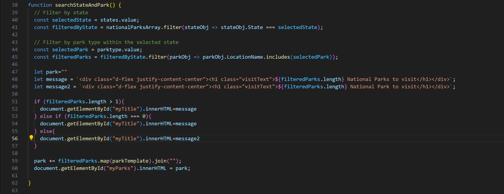

# Capstone2_Enjoy_Outdoors

 Capstone 2: Enjoy the outdoors project.

# Website: Explore

This was a project made during my Application Development track with year up.  

## Getting Started

Make sure all files are downloaded in a folder on your computer.  

### Prerequisites

What things you need to install the software and how to install them.

-Visual Studio Code (https://code.visualstudio.com/)
-Github (https://github.com/)

### Installing

Download Visual Studio Code

Download Github

Install Extention on Visual Studio:

Live Server

Open folder on Visual Studio Code and open the index file with live server on the bottom right of screen. The page should open on the home page.

## Built With

* [HTML](https://developer.mozilla.org/en-US/docs/Web/HTML)
* [CSS](https://developer.mozilla.org/en-US/docs/Web/CSS)
* [JavaScript](https://developer.mozilla.org/en-US/docs/Web/JavaScript)
* [Bootstrap](https://getbootstrap.com/)

## Deployed Link

* [See Live Site](https://juanespinozacode.github.io/Capstone2/)

## Images

### Home

### National Parks

### Mountains

### Code

## Authors

***Juan Espinoza*** 

- [Link to Github](https://github.com/JuanEspinozaCode)
- [Link to LinkedIn](https://www.linkedin.com/in/juan-espinoza-5b3410237/)

## Acknowledgments

* Pluralsight Instructor Remsey Mailjard

* My Colleagues